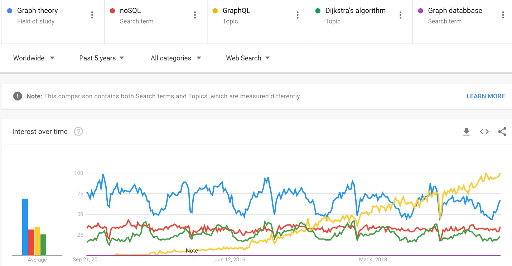
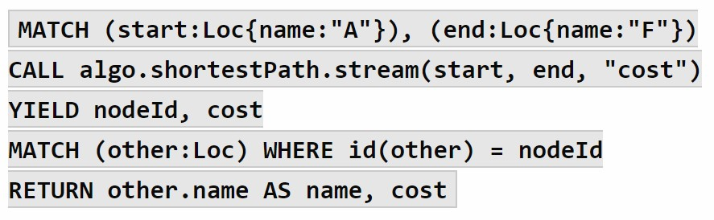

# Graph 
*Estimated read time is 6 minutes using assumption of 165 word-per-minute*

Continuing the theme from previous article on “**Stack**”, another popular word in technology today is “**Graph**”.  For the most part, graph is an harmless word referencing pictures in statistics when you plot a function onto the coordinates’ plane. It can also be humourous at times Here is a funny graph video to [start][a].

"**Graph's**" meaning depends on the branch of mathematics being discussed and eac has  deep implications from medicine to operation research. This article will summarize the concept of graph in computational science and software with relevant applications. 

## What is Graph?

Graph within the mathematics generally means two things:

* The visual representation of a function[<sup>1</sup>][1] or the basic lessons from your trigonometry class
* Graph theory in discrete mathematics[<sup>2</sup>][2] models relations between two objects.

There is entire software industry related to optimization and efficiency in generating or plotting visual representation in scientific research and data analytics[<sup>3</sup>][3]. For scope of this article, I will focus on graph theory and its application in computational science. software and database. I will briefly touch on visual presentation in relations to data analytics but not directly speak to plotting.

"**Graph**" is an *abstract data type* defined by two features:
```
A node holds the information.
```
```
An edge describes the relationship and/or connection between two nodes.
```

***That is all!***

Simplicity is the power of graph theory – the designer has flexibility to add new characteristics and/or rules as needed.

The simplest graph is a **null graph** - essnetially a node with no edges - as illustrated in the first visual example below. As you add more nodes and edges, interesting patterns emerge. See below visual example of graph theory with three nodes:


Some of the common characteristics applied to graph is:

1. **Labels** are information describing the nodes and edges itself (e.g. a, b, c, or station names);
2. **Weights** is a quantitative measure to edges instead of qualitative relations or descriptive words; and
3. **Features** (or attributes) denotes hold additional secondary information about nodes and edges themselves.

Below is a shortlist of common rules applied to graph design:

1.  Directionality set rules on edges between two nodes where the connection applies only one-way
2.  Unique labels restrict the information within each node and edge to be unique
3.  Loops allows an edge to connect with itself
4.  Heterogeneous nodes allow different types of nodes to connect with different edges
5.  Dynamic graphs allow nodes and edges to be created, deleted, moved, and/or labels and features changed.

As you see by 5th example in the visual above, the “**Tree**” *abstract data type* is essentially a special case of **Graph** – it is a collection of nodes with unidirectional edges.

As a graph grows, it becomes difficult to analyze visually. As such, graphs are often depicted two-dimensionally in a tabular format as an **Adjacency List**.  An adjacency list includes:
```
all nodes in the first column; and
```
```
the second column contains all edges connected to each node.
```

An adjacency list can be further broken down into multi-column two-dimensional table: each node listed on both the column and row axles. Edges are represented by ‘1's’ for the nodes it connects with. This representation is called an **Adjacency Matrice**.

A labelled, directional Graph example from codingame below:


This two represenations of graph will become important when applied to some real life applications.

## What are the applications of graph?

The credit for earliest, definitive application of graph theory belongs to Leonhard Euler in 1736 with his “**seven bridges of Königsberg**” problem. The problem was to 
determine the path to walk through all 8 bridges that connects 2 shores and 2 islands – can you solve it?


Euler proved there is no solution to the seven bridges problem.  Futhermore, his proof laid the foundation for Graph theory! His proof is called the Euler’s rule. and you can learn more about his solution here.


As a thought exercise, the simplest Euler's model uses 2 shores with n-th bridges. Each time there is an even number of bridges, you can return to the same shore. When you extrapolate this to n-th number of islands (or nodes), you find there is a limitation on the number of islands with odd number of bridges (or edges). To solve “**seven bridges of Königsberg**” problem will require the additional of one (1) bridge (or edge).  As the an edge connects two nodes, only 2 shores (or nodes) can have odd number of bridges (or edges) connecting it.


To this end, why does Graph theory matter?

The key takeaway with Euler's thought exercise highlights the scalability with Graph theory due to it's simplicity with only key concepts: node (i.e. the islands and shores) and edges (i.e. the bridges).  Most of the common applications of Graph theory revolves around solving different version of graphs and applying it to computational problem.  A few examples of graph algorithm to determine:
* the shortest path in a network (e.g. the traveling sales man problem);
* connectedness of nodes (e.g. rank the nodes with most edges);
* cycles in a graph (e.g. loops and infinite loops); and 
* searching for an element in a data structure (e.g. search optimization).

You can find the application of the above graph theory problems in every day life from tracking disease origins in medicine to operational research on Amazon’s optimizing their package delivery by time or distance (i.e. “shortest path”).  Some of the specific computational applications of the graph theory include:
* specialized extensions in languages to solve graph theory problems (e.g. extension of FORTRAN);
* data flow diagrams in software requirement analysis;
* determine operating system job scheduling and resource allocation;
* data analytics to determine influences in social media and rank web-pages importance;
* graph query language; and
* graph database.

## Why the interest in graph-based alternatives?

Applying graph theory to computational science is not new. The recent surge of interest in graph-based algorithm, database, and query language is due increased demand for flexibility and agility in software. There is significant amount of debates and analysis for and against graph-based query and database.



It is important for developers and product managers to keep a brisk of the noted advantages. One of the advantages is the ability to dictate intuitively what user needs from the server with data return in a predictable manner. This precision in query reduces the issues of over-fetch data and performance issues.

Let's take a look at how the relational database and query looks at the earlier example:


Relational database will require 2 tables to represent the adjacent table.


In order to determine the steps (i.e. shortest path) to travel from B to C in a relational database query, it needs to:

1. join node table to relations table by the to_id and id;
2. join node table to relations table by the from_id and id;
3. self-join to determine the potential destination linked beyond it's direct neighbhour; then
4. query the above triple-joined table.

Below is sample codes for SQL:
```
SELECT b.node AS "From", to.to_od AS "via", c.node AS "To",
FROM b
JOIN relation from ON b.id = from.from_id
JOIN relation to ON to.to_id = from.from_id
JOIN c.id ON to.to_id = c.id;
```

Comparatively, below are sample codes in Cypher (a graph-based query) to create the graph:
```
MERGE (a:Loc {name:"A"}
MERGE (b:Loc {name:"B"}
MERGE (c:Loc {name:"C"}
MERGE (a)-(b)
MERGE (a)-(c)
MERGE (b)-(a)
MERGE (c)-(b)
```
The query sample is:
```
MATCH (start:Loc{name:"B"}), (end:Loc{name:"C"})
CALL algo.shortestPath.stream(start, end)
YIELD nodeIdMATCH (other:Loc)
WHERE id(other) = nodeId
RETURN node.name other.name AS name
```

The reason for the more simplistic view in graph-based query is **Index-free adjacency** - a lack of index. In graph-based database, the query simply search for (b)-(a) then (a)-(c) - an intuitive description of how humans describes traversing from B to C with no extra information. It simply represents a user intuitively searching for 1's in the 3x3 Adjacency matrice.

In relational database, all data is indexed! The query must:
1. find node B's id --> 
2. match with relation table's from_id --> 
3. match with the second relation table's (self-joined) to_id --> 
4. find node C's id.

During this time, two sets of id's were created for both iterations of the node's tables.  It becomes obvious relational database qeuries is exponentially more complex to work with as the number of nodes increases. (Side-bar: [here][b] is a more elegant PostgreSQL solution using recursion.)

Alternatively, Graph-based database and query can be scaled quickly in solving the shortest path problem.  Below is a more elaborate example:




Graph-based database, algorithm, and query language represent a significant departure from the traditional approach to database (i.e. relational) and query languages (i.e. SQL).
The above example highlights one advantage of graph-based approach to database and query languages.  However, the example was based on a classical computational problem best solved by graph theory-based algorithms. The verdict is still out on whether (or under what conditions) graph-based alternatives outperforms the traditional approach.

# Conclusion
**Graph** theory is a key concept in discrete mathematics. With many computational science and software concepts based on dsicrete mathematics, an understanding of graph is often a requirement. This article provided a brief on theoretical concept and origin of graph theory as an *abstract data type* with relevant applications. It fruther summarized a simple comparison between relational and graph-based database in a classic graph algorithm problem - shortest path (or a version of the traveling salesman) problem.

## References
* V. Gupta, 2015, Importance o Graph Theory, Journal of Computer and Mathematical Sciences, Vol.6 (6), accessed 20 September 2019, http://compmath-journal.org/dnload/Vandana-Gupta/CMJV06I06P0306.pdf
* S.G. Shrinivas et. al., 2010, International Journal of Engineering Science and Technology, Vol. 2(9), accessed 20 September 2019, https://pdfs.semanticscholar.org/3f2e/5b88c4b631c931f6db805f4ae3c0b531a8e8.pdf
* https://blog.logrocket.com/5-reasons-you-shouldnt-be-using-graphql-61c7846e7ed3/
* https://stablekernel.com/advantages-and-disadvantages-of-graphql/
* https://www.forbes.com/sites/danwoods/2018/04/30/improve-your-graph-iq-what-are-graph-queries-graph-algorithms-and-graph-analytics/#4a74118c1961


[a]: https://www.youtube.com/watch?v=wIxf8wQH8eAGraph
[b]: https://www.periscopedata.com/blog/postgres-recursive-cte

[1]: https://en.wikipedia.org/wiki/Graph_of_a_function
[2]: https://en.wikipedia.org/wiki/Graph_(discrete_mathematics)
[3]: https://en.wikipedia.org/wiki/List_of_information_graphics_software.